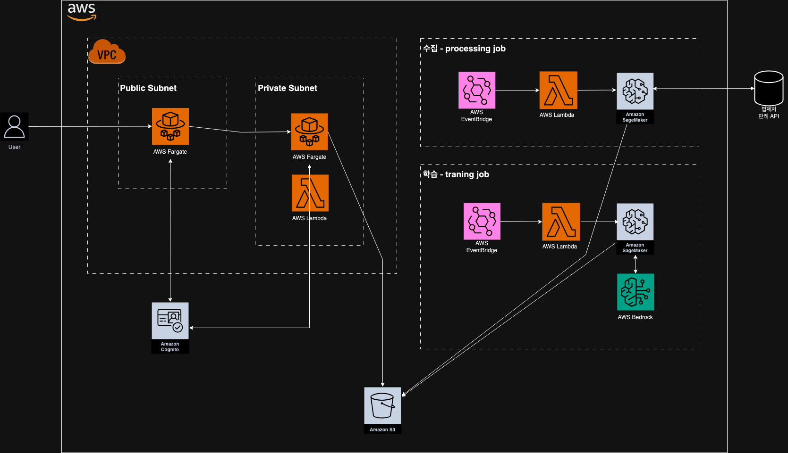

# 사건뭉치
- 세무 판례 검색으로 매일 고통받는 💩을 위해 생성형AI를 활용한 판례 검색기를 만듭니다.

### 작업 프로세스
- [ ] 0. 10년치 판례 데이터를 수집합니다. (ETL? ELT? 파이프라인 작성이 필요합니다.)
- [ ] 1. 법제처에서 제공하는 API를 활용해 "세무" 키워드에 속하는 대량의 데이터로 생성형AI를 Fine-tuning합니다.
- [ ] 2. 세무 판례의 "판결요지"를 중심으로 판례 결론과 관련있는 부분만 벡터 데이터베이스에 저장합니다.
- [ ] 3. 사용자가 질문을 입력했을 때, 벡터데이터베이스를 통해 판례를 검색하도록 검색 파이프라인을 생성합니다.
- [ ] 4. 검색 Backend를 만듭니다.
- [ ] 5. 사용자 계정 관리와 접근 가능한 UI를 만듭니다.

### 아키텍처

  

